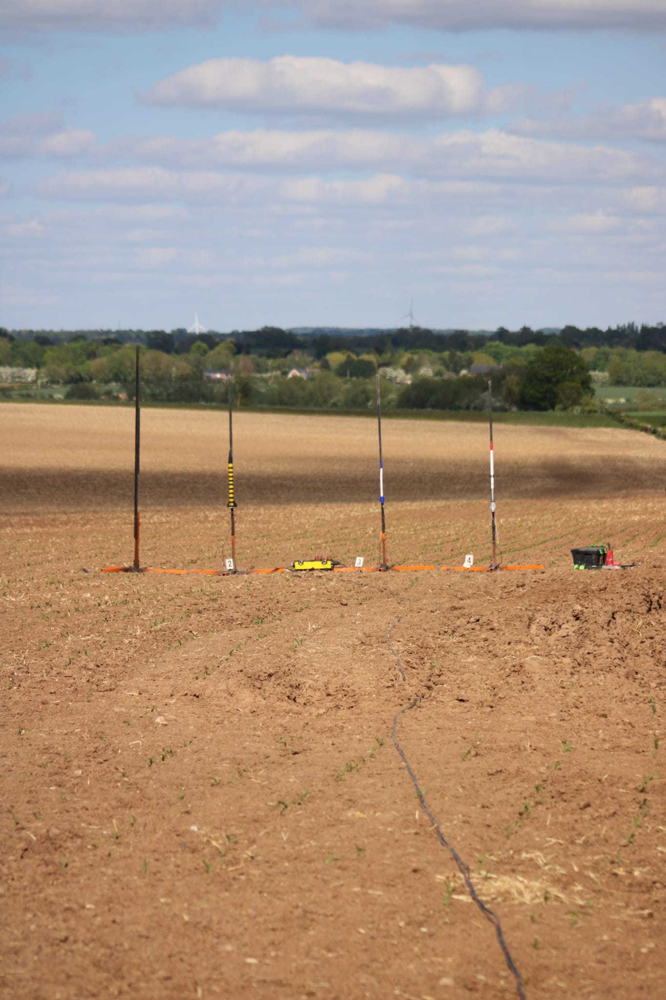
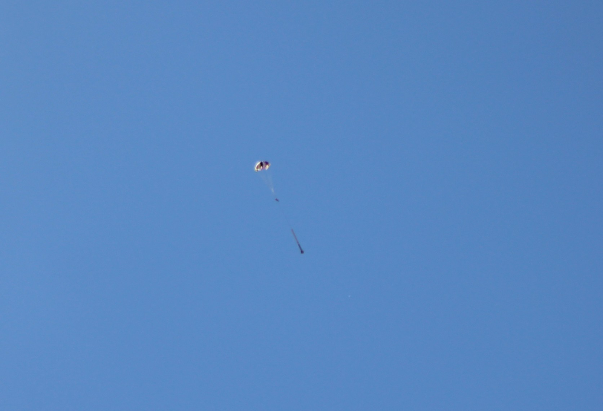
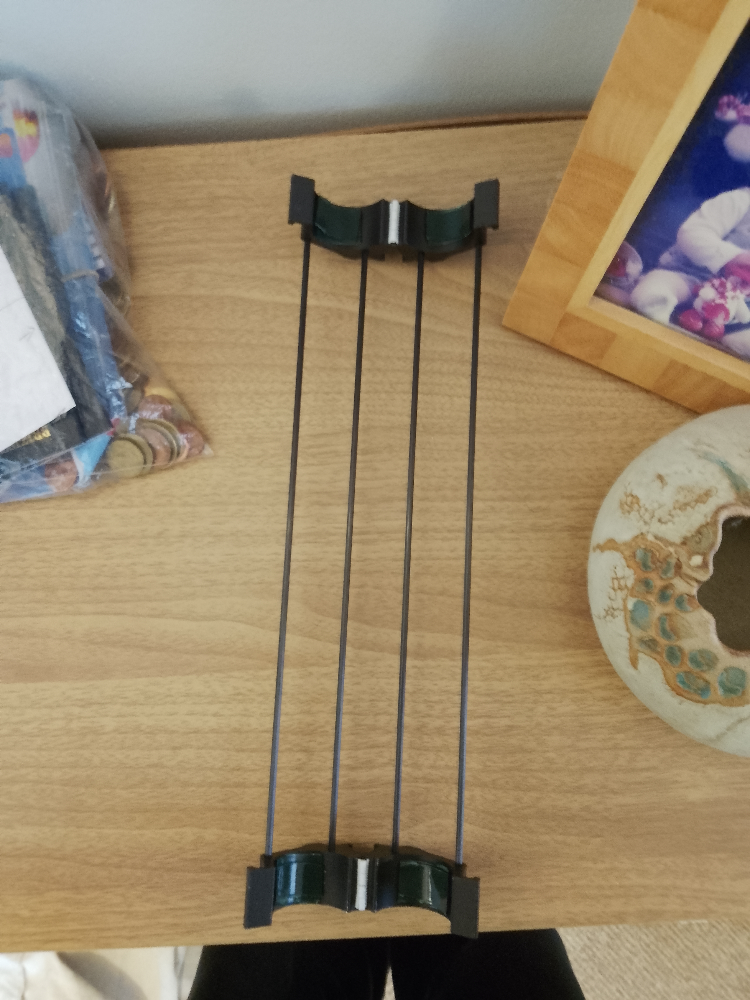

  

---

# Rocket Fly-Away Rail Guides!

Fly-away rail guides for low to mid power rockets. The guide separates from the rocket as it leaves the launch rail so that the airframe does not need to carry any permanent rail buttons or lugs. 
Flight-tested **twice** at 10G acceleration off the rail. Use at your own risk. 
Current designs are for 30–35 mm airframe OD; other sizes are planned, a tight fit on your exact rockets outer diameter can be ensured by using foam tape or similar.

---

## Design

Each guide is a top and bottom wrap-around 3D-printed section that clamps the airframe for use on a 3030 rail section, held in alignment by four 3 mm OD carbon-fibre rods, 300 mm long, running vertically between the two sections.

The wrap sections use a printed plastic hinge as the intended weakest point in the load path. On a high-g launch the hinge is designed to fail before launch loads can damage the airframe, releasing the guide rather than transmitting the load into the rocket. If you intend to fly multiple times, BRING MULTIPLE, in my experience it has always failed at the hinge on every launch so far when using cheap plastic hinges. Note I recommend using cheap plastic hinges as it prevents fin strikes from causing as much damage to the rocket.

---

## Use

Push fit the carbon fibre rods into the plastic, it is designed to be able to fall apart during a fin strike to avoid damaging the rocket. Use M2.5 or M3 screws to connect the two sides together with plastic hinges and appropriately sized metal springs.

Before flight, **ensure that the sliding friction on the rail is not too high**, otherwise your rocket may never make it off the rail. If it is too high, adjust the amount of foam tape used, spring strength and use WD40. I have only tested and dimensioned this for **3030 rail sections**, ensure that this is the rail you are flying on.

---

## Printing

Wrap sections print at ≥50% infill with ≥~4 wall lines.
Any reasonable filament is likely fine, flight tested with PLA 100% infill on a E35 motor with a ~400g mass rocket.

---

# Images

  

  

  

  

---

## License

Apache 2.0. See LICENSE.

## Safety

This is launch hardware; use it under the safety code of your national rocketry body and local club. I recommend informing the relevant people that you are using an alternate launch guide before flying.
Stay a safe distance away during launch, as the rail will fly away at reasonable speed and may scatter debris if used improperly.
